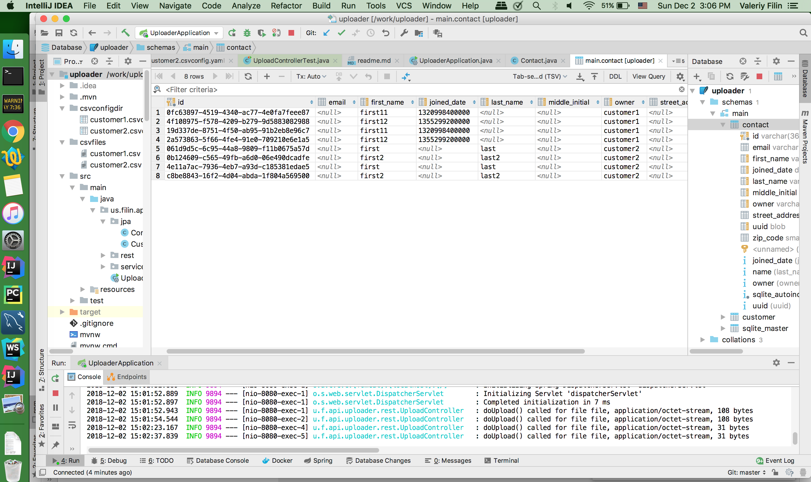

**How To Build and Run.**  

1. Clone project from [https://github.com/filinus/csvuploader.git](https://github.com/filinus/csvuploader.git)  

2. Run maven command:    

```bash
mvn clean compile test spring-boot:run
```

3. Make your post requests to endpoint: [http://localhost:8080/customer/customer1/contact/upload](http://localhost:8080/customer/customer1/contact/upload)  
  

Example:   
```bash
curl -F "file=@csvfiles/customer1.csv" http://localhost:8080/customer/customer1/contact/upload

curl -F "file=@csvfiles/customer2.csv" http://localhost:8080/customer/customer2/contact/upload
```

```
Leo:uploader val$ curl -v -F "file=@csvfiles/customer2.csv" http://localhost:8080/customer/customer2/contact/upload
*   Trying ::1...
* TCP_NODELAY set
* Connected to localhost (::1) port 8080 (#0)
> POST /customer/customer2/contact/upload HTTP/1.1
> Host: localhost:8080
> User-Agent: curl/7.54.0
> Accept: */*
> Content-Length: 236
> Expect: 100-continue
> Content-Type: multipart/form-data; boundary=------------------------085e951994279335
> 
< HTTP/1.1 100 
< HTTP/1.1 200 
< Content-Type: application/json;charset=UTF-8
< Transfer-Encoding: chunked
< Date: Sun, 02 Dec 2018 23:14:10 GMT
< 
* Connection #0 to host localhost left intact
{"message":"your csv file uploaded"}
```

4. Check content of sqlite database file:   uploader.sqlite3





**Assumptions.**

Beside text of task, my assigner mentioned that this is a few-hours task. (hours! neither days, nor weeks). It’s very serious restrictions, which leads to assumption to extremely simplify code and follow YAGNI principle (you ain’t gonna need it)

I make assumption that customer data is private, that’s why I added field “owner” to distinguish customer data. 

Because each customer could provide quite unique configuration, there is no evidence how to maintain possible duplication, even with UUIDs. We have no evidence what the big final product is. We make assumption that we need assist upload data into an sql database and that’s all.  

_Customer will have their tools, either manual, or automated, to maintain, and clean up that data_.

Thus there is not check if UUID unique, or email is valid, or zip is contains five digits. I consider everything as draft records.


Thus even customer upload same file again, we just add same items under his field “customer”, however in the ID field a UUID generate. So the table may contain to UUID columns, id generated by rest app and customer UUID, maybe empty, maybe malformed, maybe not unique. 


For columns we will stored in database a lowercased and with underscores for spaces. Thus “Zip Code” should be “zip_code”, not a “zipCode”, “zip_code, “zip code”. For java objects we will use camelCase 

Joined Date is just a day, we won’t start particular time during date.

CSV file is uploaded during one SQL transactions, all or nothing. 


**Customer's CSVConfig**

Each customer has own config file in the csvconfigdir directory, the _csvconfigdir_ option in the application.properties.  

Files are YAML files in general.

CSV config files must be names as   &lt;client name&gt;.csvconfig.yml

Note, dual part extension, it allows to make filename quite unique to apart from other files, maybe, other yams files in directory. On the other hand extension “.yaml” allows to use editors familiar with YAML

Customer name is rather login and must have alpha-numeric characters and underscore

  

All parse instructions come from the correspond YAML file.

Because CSV is not strong standard. In “csv_format” it’s possible to specify one of sub-formats  
[https://commons.apache.org/proper/commons-csv/apidocs/org/apache/commons/csv/CSVFormat.Predefined.html](https://commons.apache.org/proper/commons-csv/apidocs/org/apache/commons/csv/CSVFormat.Predefined.html)

Boolean option “has_header” specifies if CSV file has header line to be skipped. Current uploader implementation does not use CSV header line as information source.  

In section fields you may configure upto 8 fields: _first_name, last_name, middle_initial, joined_date, street_address, email, zip_code, uuid_.  

For each field you may specify number of source CSV column.    

To ignore one of possible database field user may either not mention such field or use position 0

For optional field join_date there one more special sub-option language_tag, which allow to set locale for parsed date strings.  

Sub-option required not implemented for time reason.  
  

**REST app**  

Because this microservice most probably part of bigger project, and it uploads a customer’s resource, it affects to form of the path:  

_POST /customer/{customer}/contact/upload_  

1. Thus it’s a customer resource  /customer/{customer}/  

2. What’s resource? Contact  

3. And finally upload  
  

If we would extend this, for example we can build a request like

_GET /customer/{customer}_ get customer itself

_GET /customer/{customer}/contact_ -- all customer’s contact  

_GET /customer/{customer}/contact/{id}_ -- get specific customer’s contact  

_DELETE /customer/{customer}/contact_ -- delete specific customer’s contact  
  

**POST  /customer/{customerN}/contact/upload.**

Payload is multi-part with field “file” containing the CSV.    

For path customer variable you should have correspond file customerN.csvconfig.yaml in the csvconfigdir. 


**Examples of CSVConfigs:**

_/csvconfigdir/customer1.csvconfig.yaml_
```yaml
csv_format: Default
has_header: yes
fields:
  first_name:
    required: yes
    position: 1
  join_date:
    required: yes
    position: 2
    language_tag: en
```

_/csvconfigdir/customer2.csvconfig.yaml_
```yaml
csv_format: Excel
has_header: no
fields:
  first_name:
    required: yes
    position: 2
  last_name:
    required: yes
    position: 1
```